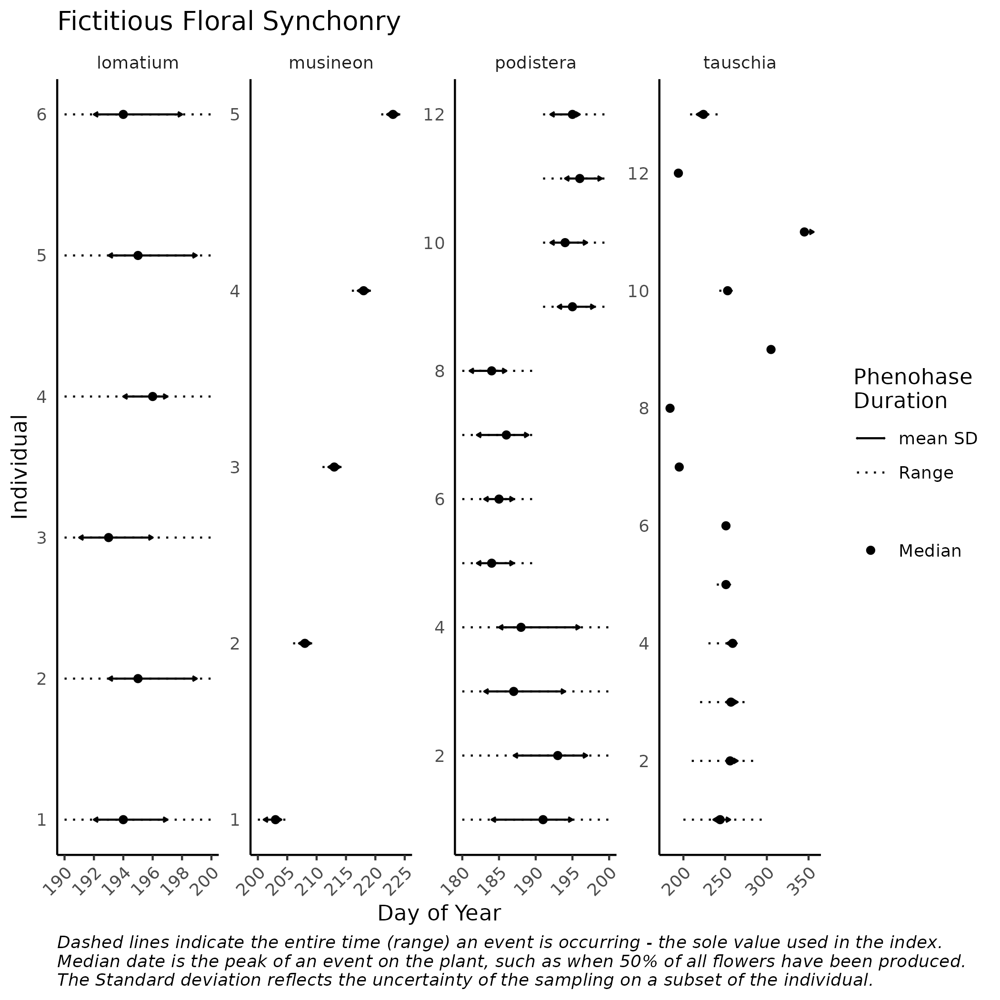
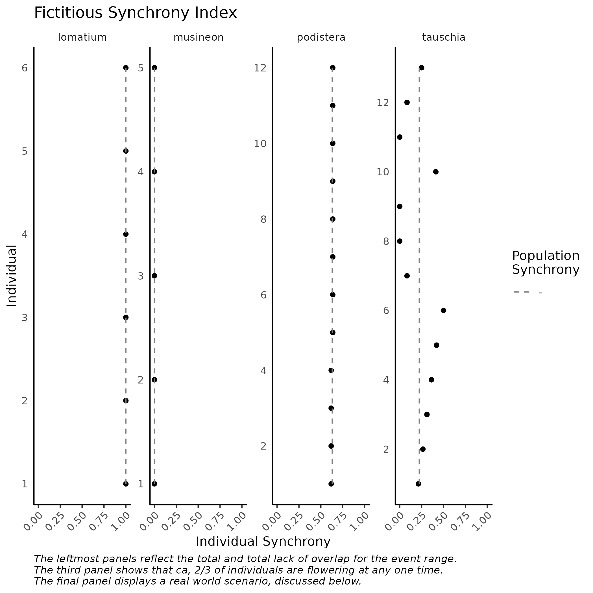

# AugspurgerIndex

A single function to calculate Augspurgers index of synchrony after Primack 1980. This function very warmly, and humbly, acknowledges Carol Augspurger, or 'Dr. A' as many alumni of UIUC have the privilege to know her. One of the only ecologists, to be a great natural historian, accomplished academic, excellent instructor, devout environmentalist, and un-paralled mentor.

This from Augspurger 1983.

> ## APPENDIX 1. Methods of Calculating Synchrony (modified from Primack 1980).
>
> **A.** Synchrony of a given individual with its conspecifics: 
> $X_{i}$, the index of synchrony for individual i, is defined
>
> $$
> X_{i} = (\frac{1}{n-1})(\frac{1}{f_{i}})\sum_{j = i}^{n} e_{j != i}
> $$
>
> where,
>
> $e_{j}$ = number of days both individuals *i* and *j* are flowering synchronously, *j* != *i*\
> $f_{i}$ = number of days individual *i* is flowering\
> $n$ = number of individuals in population
>
> When X = 1.0, perfect synchrony occurs, i.e., all flowering days of individual *i* overlap with all flowering days of each other individual, *j \# i*, in the \> population.\
> When X = 0.0, no synchrony occurs, i.e., no overlap occurs among any of the flowering days of individual *i* and any other individual, *j =# i*, in the \> population.
>
> **B.** Synchrony of the population:
> $Z$, the index of population synchrony, is defined as:
>
> $$
> Z= \frac{1}{n}\sum_{j = 1}^{n}X_{i}
> $$
>
> where $X_{i}$ is synchrony of individual *i* with its conspecifics from part A (above)

## installation

The package can be installed from either github, using the remotes package, or CRAN. For most users I recommend installing from CRAN. 

```
install.packages('remotes', dependencies = T)  
remotes::install_github('sagesteppe/AugspurgerIndex')  
```
## citation

```
citation('AugspurgerIndex')
```

Please cite AugspurgerIndex in publications using:  

  Reed C. Benkendorf (2023). AugspurgerIndex,  
  https://github.com/sagesteppe/AugspurgerIndex  

A BibTeX entry for LaTeX users is  

@Misc{,   
  title = {AugspurgerIndex},  
  author = {Reed Clark Benkendorf},  
  year = {2023},  
  url = {https://github.com/sagesteppe/AugspurgerIndex},  
}  

# Some notes about Synchrony




The fourth pane shows some un-intuitive aspects of the measure of individual synchrony. Individuals 7, 8, 9, 11, and 12, which have no to little overlap with other individuals have very low values of synchrony. Individuals 5, 6, and 10, despite having very short periods of flowering, overlap well with the lowermost individuals, and have the highest values of synchrony. Perhaps counterintuitively, individuals 1-3 which have long periods of flowering, and which overlap with fewer individuals over these time periods are the most asynchronous. In a casual sense metrics of synchrony are simply measuring the overlap in phenophase, without respect to duration.

## References:

Augspurger, Carol K. *Phenology, Flowering Synchrony, and Fruit Set of Six Neotropical Shrubs.* Biotropica, vol. 15, no. 4, 1983, pp. 257--267. JSTOR, <https://doi.org/10.2307/2387650>. Accessed 19 Mar. 2022.

Augspurger, Carol K. *Reproductive Synchrony of a Tropical Shrub: Experimental Studies on Effects of Pollinators and Seed Predators in Hybanthus Prunifolius (Violaceae).* Ecology, vol. 62, no. 3, 1981, pp. 775--788. JSTOR, <https://doi.org/10.2307/1937745>. Accessed 19 Mar. 2022.

Primack, Richard B. *Variation in the Phenology of Natural Populations of Montane Shrubs in New Zealand.* Journal of Ecology, vol. 68, no. 3, 1980, pp. 849--862. JSTOR, <https://doi.org/10.2307/2259460>. Accessed 19 Mar. 2022.
